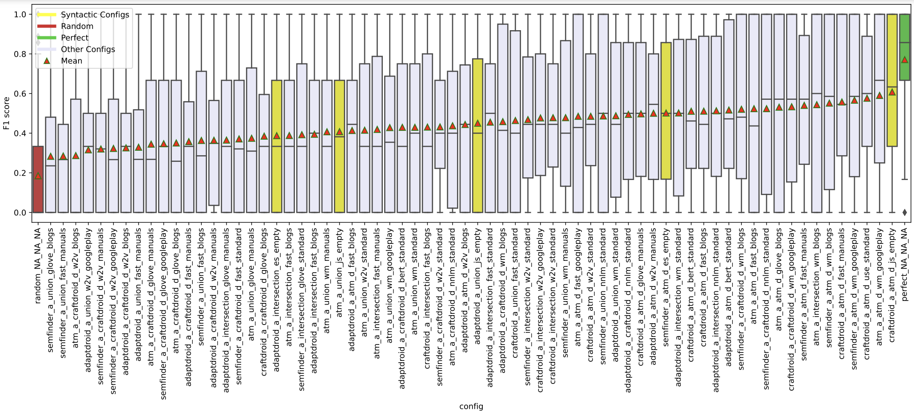
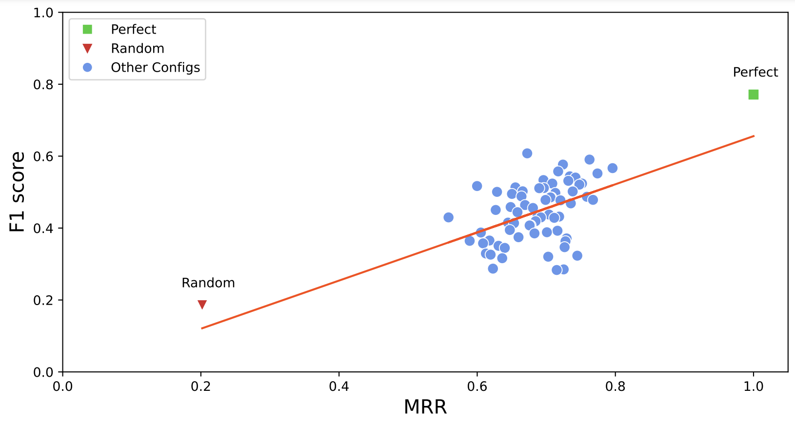
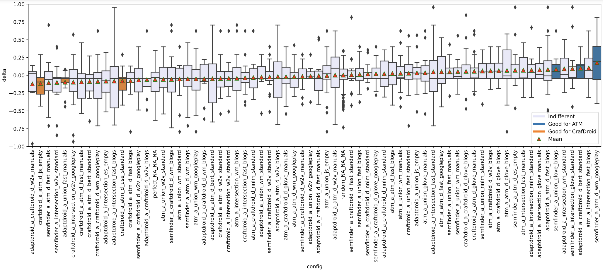

# Test Reuse Analysis
# Analyzer

This artifact produce tables and figures of the study related to semantic matching in test reuse context.

**Input:**

- Evaluation results of test cases: `fidelity_plugin/data/output/evaluation/`
- Semantic matching in isolation results: `semantic_matching_results`

**Output:**

- Aggregation of configurations evaluation: `aggrigator/full`

  This folder contains fidelity metrics of each semantic matching configurations
- Config performance: `aggrigator/config_f1_performance`

  The plots in the directory show performance of each semantic matching configuration as a boxplot. 

*Example of aggregated performance of migrations grouped by config*
- Correlation Analysis Table: `correlation_calc/corr.csv`

  The table shows correlation of the F1-Score (test reuse metric) with Top1 and MRR (Semantic Matching). Each row
  correspond to a specific setup by test generator, subjects, oracle inclusion.

- Correlation Analysis Plot: `correlation_calc/plots`
  
  The plots show correlation of test reuse and semantic matching. Each dot represents a semantic matching config which
  are positioned based on their performance in test reuse and semantic matching in isolation.

*Example of the correlation plot*

- Impact analysis: `test_reuse_evaluator/analyzer/analysis/plots/impact_reuse.pdf`
  
  The plot show impact of each semantic matching component divided by the test generator.
  
- Effectiveness: `test_reuse_evaluator/analyzer/analysis/tables/`
  The tables report effectiveness of each semantic matching instances.

- Configurations delta: `delta_calc`
  
  The plot shows if a semantic matching config benefited either of test generators more than the other. The ones on the
  left favors CraftDroid and ones on the right ATM. Configs in orange (favors CraftDroid) or blue (favors ATM) have
  statistical significance.

*Example of the delta plot*
  
- Test cases events plots: `test_case_len`
  
    The plots report number of event in test cases.

### Run

1. Activate the virtual environment.
1. For each type of output run the corresponding python file in the related folder.
